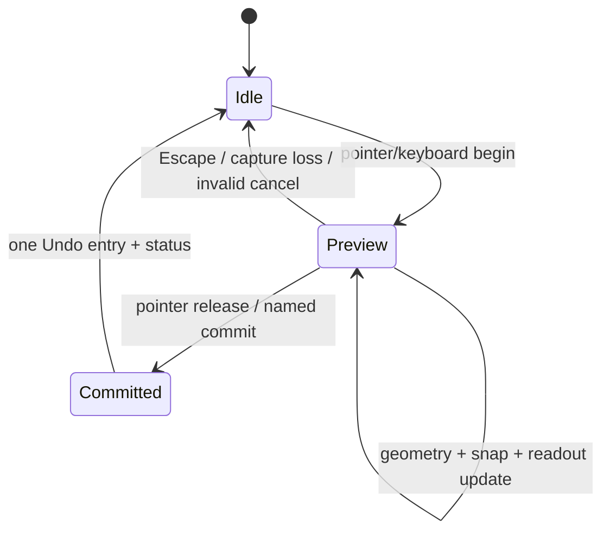
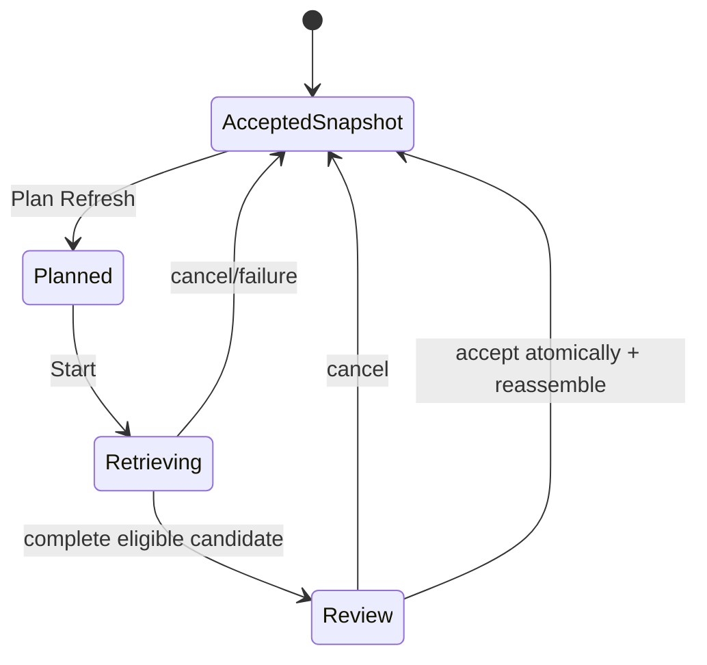

# RSrender Layout Studio UX specification

**Status:** Decision-complete v1 for GitHub #23 under the product owner's standing acceptance of recommended choices  
**Evidence cut:** 2026-08-14  
**Scope:** Desktop workspaces, panes, page views, selection, hierarchy, direct manipulation, precision layout, properties, contextual commands, text/data feedback, diagnostics, template assignment, Refresh, lifecycle prompts, and PDF publication  
**Not in scope:** Production implementation, visual brand system, renderer/process topology, package/container mechanics, source-write behavior, or claims of performance/accessibility acceptance

## 1. Outcome and authority

RSrender is one multi-document Electron application with two task-oriented workspaces:

- **Production workspace** assembles a Log Project, selects and groups Explorations, assigns shared Embedded Template Representations, reviews generated Boring Logs, creates Presentation Overrides and Freeform Annotations, resolves Diagnostics, deliberately Refreshes Source Data, and publishes Log Documents.
- **Advanced Design workspace** edits a Log Template or a project-owned Embedded Template Representation: Template Variants, Page Regions, Contents hierarchy, elements, bindings, Named Styles, Template Components, Example Dataset, page geometry, and overflow behavior.

The workspaces are projections over the same renderer-neutral scene, command, selection, history, domain, and lifecycle authorities. Switching workspace never converts, copies, saves, Refreshes, publishes, or changes Document Identity. It is nondirty workspace state. A command has the same name, precondition, undo boundary, and result wherever it is invoked.

This specification is controlled by:

- the [atomic capability matrix](arcgis-layout-atomic-capability-matrix.md), whose IDs provide traceability rather than implementation class names;
- the [layout/lifecycle prototype decisions](prototype-decisions-layout-lifecycle.md), including the #18 command model and #34 keyboard constraints;
- the [lifecycle conflict state and command specification](lifecycle-conflict-state-command-specification.md), which is authoritative for Save, External Change, recovery, Close/Quit, and lifecycle prompts;
- the [boring-log domain model](boring-log-domain-model.md), which is authoritative for Source Snapshot, Render Dataset, value states, template sharing, annotations, page ranges, and Data Tracks;
- the [minimum-endpoint workload and performance envelope](minimum-endpoint-workload-performance-envelope.md); and
- the [live #30 validation ticket](https://github.com/blaynesatcentral/RSrender/issues/30), which records an environment block, **not** a DOM/SVG performance pass.

ArcGIS Pro Layout is clean-room comparative evidence only. RSrender does not copy Esri code, assets, strings, icons, formats, branding, interaction styling, or trade dress.

## 2. Workspace and surface model

### 2.1 Common application shell

Every document window exposes these common surfaces:

| Surface | Required behavior | State owner |
|---|---|---|
| Title and document tabs | File type, display name, dirty marker, read-only/conflict/save state, close command; each tab has isolated selection and Undo/Redo | Lifecycle state except active tab, which is workspace state |
| Main menu | File, Edit, View, Insert, Format, Arrange, Data, Publication, Help; complete named command routes | Application plus active-document command state |
| Command bar | High-frequency commands for the current workspace; never the only route | Workspace state |
| Command search | Search by command name, shortcut, context, and disabled reason | Workspace state |
| Document workspace | Production or Advanced Design panes around the active Canvas | Workspace state |
| Status bar | Focused surface, page/exploration/range, zoom, coordinates, snap state, current job, concise committed-command status | Transient workspace/job state |
| Jobs surface | Background Refresh/export/save-adjacent jobs with stage, progress where determinate, safe cancellation availability, result, and Open/Reveal/Details | Job/lifecycle authority |
| Recovery Review | Persistent non-modal candidate groups and commands defined by the lifecycle specification | Lifecycle authority |

New/Open/Recent begins on a start surface when no document is active. Recent Files shows type, last known path, missing/unavailable status, pin state, Locate, Remove, and Clear commands. It never probes RSLog, accepts a Refresh, or treats a Recovery Candidate as a recent Authoritative File.

### 2.2 Production workspace

The Production workspace is the default for a Log Project. Its minimum desktop arrangement is:

```text
Source / Log Set / Assignments | Generated-page Canvas | Properties
                               |                       |
                               +-- Diagnostics / Jobs --+
```

Its panes are:

1. **Source & Refresh** — current Source Context, accepted Snapshot identity/freshness, collection outcomes, Supplemental Sources, deliberate Plan Refresh/Review/Accept, and Source Resolution Decisions. Authentication secrets never appear as bindable data.
2. **Log Set** — ordered Exploration memberships and nested Exploration Groups, included state, effective Template Assignment, generated page count, current Diagnostic summary, and first/previous/next/last navigation.
3. **Assignments** — Log Set, group, and Exploration assignment scopes; exact Embedded Template Representation identity/digest; missing/changed-library state; Edit Shared Template and Save as Separate Template routes.
4. **Contents** — complete semantic inventory for the active generated page, including hidden and effectively locked items. Structure inherited from the effective template is inspectable; project-owned annotations and applicable overrides are distinguishable.
5. **Generated-page Canvas** — live immutable Render Dataset plus effective template, annotations, page plan, and project presentation state. It supports inspection, annotation placement, Display Value Override creation, and commands whose ownership is project-local. Editing shared template structure routes deliberately to Advanced Design.
6. **Properties** — exact selected scope, original source value/provenance where relevant, override/annotation controls, page/range metadata, and read-only template properties with an **Edit Shared Template** route.
7. **Diagnostics** and **Jobs** — shared surfaces described below.

Changing a bound value in Production creates or edits a Display Value Override. It never mutates Source Data and never silently detaches bound text. Structural formatting changes to an Embedded Template Representation visibly affect every referencing assignment; per-scope divergence requires Save as Separate Template plus reassignment.

### 2.3 Advanced Design workspace

Advanced Design is the default for a Log Template and is entered deliberately for an Embedded Template Representation. Its persistent desktop arrangement is the #18 three-pane Workbench:

```text
Catalog / Contents | Layout Canvas | Properties
                   |               |
                   + Diagnostics / Data Preview +
```

Its panes are:

1. **Catalog** — Template Variants, Page Regions, Named Styles, Template Components, embedded fonts/assets, Example Dataset scenarios, and admissible element types. Catalog search does not change selection.
2. **Contents** — canonical hierarchy and render order for the active Template Variant or focused component. It is the complete semantic alternative to the spatial Canvas.
3. **Layout Canvas** — rulers, margins, grid, guides, page, regions, elements, selection/Key Element, handles, live binding evaluation, and nonprinting Diagnostics.
4. **Properties** — complete common and type-specific property scope.
5. **Data Preview & Binding Browser** — Example Dataset or chosen project preview context, typed paths, cardinality, formatting, empty-value policy, evaluated value, and provenance category.
6. **Diagnostics** — overflow, binding, font, constraint, page-plan, asset, and integrity findings.

**Focused Canvas** may temporarily collapse panes and maximize the Canvas. It is a view command, not a third behavioral workspace. The tree-first prototype is not a separate product mode; its useful large-tree and keyboard ideas are part of Contents.

### 2.4 Pane behavior

- Contents, Canvas, and Properties remain simultaneously available in the default Advanced Design arrangement.
- Panes may collapse, resize, move among documented docking regions, or become a tab in a region. Arbitrary floating-window choreography is deferred.
- Pane arrangement, width, active pane tab, filters, selection, page, zoom, and pan are workspace/session state and do not dirty the document.
- F6 and Shift+F6 move through visible major surfaces in a documented order. Closing a pane returns focus to the invoking control or nearest surviving logical surface.
- A compact layout may tab panes, but it must not remove any command or property.

## 3. Page and editing modes

| Mode | Canvas authority | Allowed mutations | Entry/exit feedback |
|---|---|---|---|
| Template Variant Design | One Template Variant plus selected Example Dataset/project preview | Template hierarchy, geometry, style, bindings, page geometry, guides/grid | Variant, example context, units, page size, dirty state |
| Generated Log Set Overview | Immutable page plan with page thumbnails/list | Navigation, selection, page-plan commands, project-local actions | Page count, Exploration, role, range, Diagnostic counts |
| Generated Page Focus | One page occurrence of one Boring Log | Overrides, annotations, project-local settings; shared structure requires deliberate template edit | Page identity, stable Exploration, Template Variant, Reference Depth Range |
| Focused Component | One Data Track or Template Component definition with breadcrumb | Definition-owned children/properties only | Outer scene dims and becomes unavailable; Escape/Exit returns focus |
| Publication Preflight | Exact immutable export candidate | Warning acknowledgment/suppression where authorized; no scene mutation hidden inside export | Candidate revision, scope, sizes, errors/warnings, destination |
| Compare/Refresh Review | Baseline/local/external or accepted/candidate facts | Only named resolution commands | Comparison basis, provenance, conflict and mutation-freeze state |

Generated page order is native Log Set behavior, not an ArcGIS map-series emulation. Internal Reference Depth Ranges are half-open; a boundary observation belongs to the deeper page. The final range includes terminal project depth.

Users edit per-page depth scale through exact shared-boundary controls. **Move Boundary** changes the shallower range end and deeper range start in one command. First start and final end have separate exact controls. Invalid, reversed, duplicate, uncovered, or overlapping ranges do not commit silently; the editor retains the proposed value, identifies affected pages, and provides a remedy. Each page reports physical Depth Body height, depth range, and resulting scale.

Template Variants own page size, orientation, margins, and Page Regions. The default **Resize Page** behavior retains authored physical geometry and applies explicit Layout Pins; it never silently scales all content. **Scale Content to Page** is a separate previewed command that reports its factor, affected properties, text remeasurement, and resulting Diagnostics before one undoable commit. Creating a differently sized role uses **Duplicate Variant** or **New Variant**, not hidden revision history.

## 4. Selection and Key Element

### 4.1 Shared model

- Canvas and Contents read and write one ordered, active-page selection.
- A normal click selects one item. Shift+click on Canvas or Contents, and Shift+Space in Contents, toggles one item without clearing the others.
- The last item added becomes Key Element. Removing it promotes the most recently added remaining member. **Set as Key Element** deliberately promotes another selected item.
- Canvas handles, Contents rows, Properties heading, status text, and accessible state expose selection. Key Element has a distinct non-colour cue and is named in announcements.
- Ctrl+A selects every eligible item on the active page, not other pages, hidden generated pages, Catalog items, or source records.
- Escape first cancels an active inline edit/gesture/menu; the next Escape clears selection. Empty-canvas click clears selection when no gesture is active.
- Hidden items remain selectable from Contents. Effectively locked items remain inspectable there even when removed from editable Canvas Tab order.

### 4.2 Marquee and overlaps

Marquee begins only from empty Canvas space with the Select tool active. The rectangle shows live candidate outlines and commits items whose transformed page-space painted bounds intersect it. Holding Alt switches to containment-only; holding Shift toggles the committed candidates against the existing selection. Zero-distance drag remains an empty-space click.

For overlaps, the first click selects the topmost eligible item. Repeated Alt+click at the same tolerance-stable point cycles front-to-back. **Select Overlapping** in the identical Canvas/Contents context menu lists stable name, type, container, and z-order; keyboard users may always select the same candidates in Contents. Any scene/order change resets the cycle.

### 4.3 Multi-edit and alignment

- Properties shows only the typed intersection of selected items. Shared values appear normally; mixed values display **Mixed**, never blank.
- A batch property command is all-or-none across its declared eligible set. It previews affected/excluded counts and never silently changes only an arbitrary subset.
- Align left/center/right/top/middle/bottom and Match width/height/both keep the Key Element fixed. Explicit alternative reference targets are Page or named Page Region.
- Alignment may skip effectively locked members only when the command preview names every skipped item and at least one other item can move. Hierarchy, delete, group, reparent, and common-style batch commands are disabled if any required member is ineligible.
- Horizontal/vertical gap distribution uses page-axis-aligned transformed bounds. The two outermost eligible items stay fixed; at least three eligible items are required. Locked selected items are excluded and reported. Any pin/constraint violation rejects the whole proposed distribution.
- Centre distribution has named horizontal and vertical commands. No arrangement command silently changes rotation, parents, pins, or render order.

## 5. Contents hierarchy, render order, visibility, and lock

### 5.1 Hierarchy contract

Contents names its current root and lists every group, subgroup, Page Region, Log Column, Data Track, Axis, Data Layer, Template Component child, graphic, text, annotation, and other applicable semantic item. Top sibling is frontmost. Search/filter is nondirty and non-mutating.

Filtering preserves selection. A persistent summary reports selected items hidden by the filter; Canvas selection remains visible where renderable. If the focused row is filtered out, focus moves to the filter control and announces the hidden focused item rather than silently selecting another row.

Generic Group is a transform container. It is not a Page Region, Log Column, Data Track, Exploration Group, or Template Component. Typed containment rules determine valid children, and cycles are always invalid.

### 5.2 Reorder and reparent

Pointer tree movement has three visually and semantically distinct targets:

- an insertion line before a row;
- an insertion line after a row; or
- a containment highlight on a valid container.

Hover expansion and autoscroll are available after a bounded delay. The preview names **Move before**, **Move after**, or **Move into** and identifies the target. Invalid targets show the reason and cannot accept a drop. Escape cancels. Commit creates exactly one named Undo command and restores focus by stable identity.

Alt+Up/Down reorders within siblings. Alt+Left moves to the nearest valid parent level; Alt+Right moves into the preceding valid container when unambiguous, otherwise opens a named target chooser. Bring to Front/Forward/Backward/Back provide a non-drag route. Reparenting preserves page-space appearance by converting coordinates into the new container when semantics permit; semantic conversion is never inferred.

### 5.3 Local and effective state permission matrix

| State | Canvas | Contents/Properties | Mutation |
|---|---|---|---|
| Visible and editable | Rendered and directly editable | Full inspection/edit | Allowed by type/constraint |
| Locally hidden | Not rendered | Row remains; local/effective reason shown | Show allowed if not effectively locked |
| Hidden by ancestor/domain condition | Not rendered | Local value preserved; cause and **Go to cause** available | Local value may change only if not effectively locked; it cannot make the item effectively visible |
| Locally locked | Rendered but no transform handles/Canvas Tab stop | Inspect, copy, Report position, visibility review, **Unlock** | Unlock is the only state-changing exception on that item |
| Locked by ancestor | Rendered but not directly editable | Inspect and **Go to locking ancestor** | Child mutation blocked; unlock the owning ancestor first |
| Mixed selection | Editable cues only for eligible members | Counts and reasons shown | Command-specific all-or-none or explicit skip rule; never silent partial mutation |

Toggling a parent never overwrites a child's local state. Effective Visibility and Effective Lock State are derived, named, and conveyed without relying on colour or icon shape alone. Hidden content is not published in v1.

## 6. Direct manipulation and exact geometry

Every gesture follows one transaction:



Preview updates the existing visual and semantic projection in place. It does not rebuild Contents or add Undo entries per frame. A no-move pointer interaction remains selection, not a transform.

Selected transformable items show eight resize handles and one offset rotation handle. Handles are screen-space targets with adequate hit area and do not change printed geometry. Rotation uses the element's geometric centre; Position Anchor controls coordinates and auto-growth, not rotation pivot. Named Rotate Left/Right 90° and exact angle input provide non-pointer paths.

Modifier contract while Canvas has focus:

| Operation | Default | Shift | Alt | Ctrl |
|---|---|---|---|---|
| Resize | Free edge/corner resize | Preserve aspect ratio | Resize from centre | Temporarily bypass snapping |
| Rotate | Free angle | Snap to 15° increments | No alternate meaning | Temporarily bypass snapping |
| Move | Snap by enabled classes | Constrain to dominant page axis after threshold | Duplicate-preview; commit creates one copy command | Temporarily bypass snapping |

Modifiers combine only when their meanings do not conflict; the status bar names active constraints. Pointer, nudge, exact fields, Arrange commands, context menus, and toolbar commands call the same geometry commands.

Arrow keys nudge selection by the document's displayed normal increment; Shift+Arrow uses coarse and Alt+Arrow fine increment. Defaults are 1 pt, 10 pt, and 0.1 pt. They are template-owned precision settings stored in canonical physical units: changing them in Advanced Design is dirty and undoable, while a Log Project inherits them from its Embedded Template Representation. Space+Arrow or Space+drag pans without moving content. Repeated nudges coalesce into one command after the interaction idle boundary while retaining exact intermediate feedback.

### 6.1 Position Anchors and Layout Pins

- Every positionable element chooses one of nine Position Anchors. X/Y report that point in page coordinates; auto-growth proceeds away from it.
- Layout Pins connect left/right/top/bottom element edges to named Page Region edges using exact offsets. One pin preserves offset; opposing pins drive size. Pins are template content, visible in Properties and on demand on Canvas.
- Driven fields remain inspectable but are read-only with a **Controlled by Layout Pin** explanation and route to the pin.
- Contradictory pins, negative driven size, cross-region pinning, or cyclic constraints produce a Diagnostic and reject the commit. No solver silently drops a pin.
- Group transforms use group bounds; loose multi-selection exact edits say whether the value is per-item or selection-bounds before commit.

## 7. Rulers, grid, guides, and snapping

Rulers use canonical page units and show adaptive ticks at the current zoom. Page origin, margins, Page Regions, Log Columns, and depth ticks are named targets.

Guide add/move/delete and grid spacing/origin are template content: they are undoable, dirty the template, and persist. Ruler visibility, guide visibility, grid visibility, snap master, and enabled snap classes are nondirty workspace preferences. A hidden guide does not snap by default. An explicit **Snap to hidden guides** preference, if enabled, is visibly persistent in the status bar.

Guides may be dragged from a ruler or entered in a table with orientation, exact position, and optional non-colour category label. Arbitrary guide colour is deferred. Delete All Guides names the count and requires confirmation when nonzero.

Snapping classes are independently enabled for page edges, margins, Page Regions/Log Columns, visible guides, element edges/centres/anchors, grid, and applicable depth ticks. Candidate choice is:

1. candidates within the fixed screen-space threshold only;
2. smallest screen-space distance;
3. at an equal rounded distance, visible guide, region/column, element, margin/page, grid, then depth-tick priority;
4. stable target identity as the final tie-breaker.

The Canvas shows target type, target name/identity shorthand, snapped coordinate, and guide line. Tab cycles other currently eligible equal-position candidates before release. Ctrl bypasses snapping temporarily and shows **Snap off**. Snap preview never commits a guide, pin, or constraint.

## 8. Properties and formatting

### 8.1 Pane structure

Properties always shows a persistent scope header: exact type, stable display name, owning container/page, selected count, Key Element where relevant, lock/visibility state, and whether the subject is template-owned or project-owned.

Sections appear only when applicable:

- Identity & state;
- Geometry & Position Anchor;
- Layout Pins & constraints;
- Appearance;
- Content;
- Typography;
- Text frame & overflow;
- Data binding & formatting;
- Axis/layer/interval behavior;
- Accessibility & publication semantics;
- Provenance/override state; and
- Diagnostics.

**Format** from any command surface opens Properties, selects the same subject, focuses the element-specific first relevant section, and exposes the complete scope. It never opens a reduced context-only formatter.

### 8.2 Text properties

Every text element exposes, without RSLog's arbitrary restrictions:

- bounded rich runs; font family, exact face, weight, italic, underline, super/subscript where supported;
- decimal point size, colour, line spacing, letter spacing, horizontal/vertical alignment, and paragraph/list controls in the admitted subset;
- text-frame X/Y/width/height, Position Anchor, padding by side, fill/background, border colour/weight/dash, corner treatment where supported, and element/part transparency;
- container kind, wrap, clip-with-Diagnostic, shrink minimum, constrained grow direction, semantic continuation eligibility, and explicit failure policy; and
- static content or typed data binding, formatter, empty-value behavior, and evaluated/source-range preview.

Text background is an ordinary complete text-frame property, not a hidden graphic behind the text.

### 8.3 Input state machine and mixed values

Typing into an editable field creates a staged buffer and live preview labelled **Preview**. Enter or Apply commits one command. Escape restores the committed value. Tab attempts commit and moves only if valid. Pointer blur does not silently commit an invalid or incomplete value; the staged indicator remains and selection change offers **Apply**, **Discard**, or **Cancel Selection Change**.

Invalid input remains visible with an associated error, permitted range/unit, and remedy. Focus moves only on explicit error review or failed commit. Mixed fields show **Mixed**; editing replaces the property for the full declared eligible set after affected/excluded preview. Clearing a mixed field is never interpreted as setting blank/null.

### 8.4 Named Styles and Template Components

Named Styles are template-local live definitions. Elements show inherited values and explicit per-property overrides. **Reset to Style** removes selected overrides. Editing a Named Style previews every affected element/page and Diagnostic delta before one commit. Resolved fallback values and dependencies stay package-contained.

A Template Component is a template-local reusable definition with stable instances. **Edit Component** enters Focused Component mode; committed definition changes preview all instances. Allowed instance overrides are explicit per property. **Detach Component** creates independent elements with new identities and records provenance. It is not a Presentation Override.

## 9. Identical contextual-command surface

Every selectable element, group, subgroup, Page Region, Log Column, Data Track, Axis, Data Layer, Template Component, annotation, or other applicable item exposes the same computed context menu from:

- Canvas right-click;
- Contents right-click; and
- keyboard Menu key or Shift+F10 on the focused selected item.

Right-clicking an unselected item selects only it before opening. Right-clicking any member of the current multi-selection preserves that selection. The keyboard route never changes selection implicitly.

The menu is built from the named command registry and may include Cut, Copy, Paste, Duplicate, Delete, Rename, Group/Ungroup, reorder, reparent, visibility, lock/unlock, Set as Key Element, alignment, distribution, matching size, source/override/provenance actions, Diagnostic navigation, and **Format**. It includes only commands common to all selected items or explicitly defined as batch-capable. Disabled commands remain visible when they teach an expected action and expose a concise reason/remedy to pointer and assistive-technology users.

For text, **Format** reaches all typography, text-frame geometry, fill/background, border, padding, transparency, overflow, and data-binding properties. For Data Track and other semantic containers, **Format** reaches both container properties and a clearly separated child list. No context-menu command is exclusive: main menu, toolbar/command search, shortcut where assigned, or Properties supplies an accessible route.

Rulers and guides have their own contextual targets for Add Guide Here, exact guide properties, Delete Guide, Delete All Guides, visibility, grid, and snapping. These do not replace View/Properties routes.

## 10. Command and shortcut contract

Shortcut routing follows focused surface and active editing mode. A printable command reference and command search show the effective route and disabled reason. User remapping is deferred.

| Command | Default Windows route |
|---|---|
| New / Open / Save / Save As / Close | Ctrl+N / Ctrl+O / Ctrl+S / Ctrl+Shift+S / Ctrl+W |
| Undo / Redo | Ctrl+Z / Ctrl+Y; Ctrl+Shift+Z is an accepted Redo alias |
| Cut / Copy / Paste / Duplicate / Delete | Ctrl+X / Ctrl+C / Ctrl+V / Ctrl+D / Delete |
| Select all active page / clear | Ctrl+A / Escape after cancel routing |
| Context menu / Format | Menu or Shift+F10 / Alt+Enter |
| Rename | F2 in Contents/Catalog |
| Command search | Ctrl+Shift+P |
| Move among major panes | F6 / Shift+F6 |
| Contents navigation | Up/Down; Left/Right collapse/expand; Shift+Space toggle selection |
| Contents reorder/reparent | Alt+Up/Down; Alt+Left/Right as defined in §5.2 |
| Canvas nudge / coarse / fine | Arrow / Shift+Arrow / Alt+Arrow |
| Temporary pan | Space+drag or Space+Arrow |
| Zoom in/out; actual size; fit page; fit width; fit selection | Ctrl++ / Ctrl+-; Ctrl+1; Ctrl+0; Ctrl+2; Ctrl+3 |
| Report selected position | command search, context menu, and assigned accessible toolbar control |

When inline text or a property editor owns a key, text-editing behavior wins until commit/cancel. Escape never discards a document or cancels Save/export. Lifecycle dialogs follow their dedicated Enter/Escape contract.

## 11. Clipboard, duplication, deletion, and Undo

Copy serializes the selected renderer-neutral fragment plus admitted embedded assets, Named Style references/resolved values, binding identities, and dependency manifest. Paste validates target type and dependencies before commit, creates new element identities, selects the new items, and uses one visible offset in the same page. **Paste in Place** is separately named. Cross-document paste offers explicit reuse/remap/embed decisions; it never silently links to the source document.

Cut commits removal only after clipboard serialization succeeds. Duplicate is one command and does not depend on the OS clipboard. Delete previews dependent bindings, component instances, pins, semantic publication order, and affected Diagnostics; blocked dependencies name remedies.

Direct manipulation, multi-property Apply, grouping, reparenting, arrangement, template assignment, Named Style change, guide edit, Refresh acceptance, override/suppression, and annotation change each create one named document command. Cancel creates none. Save, Save As, export, file binding, Close/Quit, and lifecycle reconciliation are not Undo commands. MVP exposes one chronological document Undo sequence; category-filtered history is rejected.

## 12. Data binding, live rendering, and text overflow

### 12.1 Binding workflow

The Binding Browser begins from a typed scope: Example Dataset in a Log Template, or immutable Render Dataset in a Log Project. It exposes stable identity separately from display labels; source/supplemental/override provenance remains visible.

A binding specifies root, record/collection scope, field, stable ordering/filter in the admitted set, cardinality, formatter, units/date/number rules, delimiter or repeated layout, and empty-value policy. Supported empty outcomes are blank, explicit placeholder, suppress wrapper, or Diagnostic; canonical absent/null/empty/zero/unavailable states never collapse. Authorized Source Extensions require deliberate selection and retain `SOURCE_EXTENSION_SEMANTICS_UNTYPED` until promoted.

Binding tokens in text are atomic inline objects. Arrow keys move across them; a first Backspace/Delete selects the token and the next deletes it. Typing cannot split an identity/path token. Formatting across a token affects its presentation only; binding formatter changes occur in Binding properties. Malformed pasted token syntax becomes inert text plus Diagnostic, never an executable or guessed binding.

### 12.2 Live evaluation

The Canvas re-evaluates locally after content, geometry, style, binding, Example Dataset, page-plan, accepted Refresh, Supplemental Source, Source Resolution Decision, or Presentation Override changes. Network retrieval is never triggered by preview or export.

Template Design defaults to embedded Example Dataset and can select declared fixture/scenario records. Production uses retained Source Snapshot plus admitted Supplemental Sources and Overrides, including offline. Freshness, Example versus source-backed context, and overridden values are continuously visible.

### 12.3 Overflow contract

One recorded text measurement owns preview, source ranges, fit outcome, continuation, Diagnostics, and publication input. Canvas zoom and display DPI never change authored geometry or the fit result.

Each text container chooses one explicit policy:

| Policy | Result | Failure behavior |
|---|---|---|
| Wrap in fixed frame | Preserve authored font and frame | Overflow Diagnostic; never silent clip |
| Clip with Diagnostic | Deliberately clip at frame | Clipped source range remains inspectable; export policy sees Diagnostic |
| Shrink to minimum | Bounded search to declared minimum | Effective size shown; overflow-at-minimum Diagnostic |
| Grow height/width | Grow away from Position Anchor subject to pins/region | Collision/constraint/maximum failure Diagnostic |
| Semantic continuation | Emit lossless consumed source ranges into ordered eligible targets/pages | Gap, duplicate, cycle, missing target, or remaining-range Diagnostic |
| Fail | Keep authored geometry/content | Immediate unsuppressible fit failure input for publication policy |

Generic newspaper-style text columns are deferred. Semantic continuation is available only to explicitly continuable bound record/text scopes with stable source ranges and target order; it never flows arbitrary page graphics or geotechnical evidence by guesswork. No required evidence is omitted to make a page fit.

Overflow appears simultaneously as a non-colour Canvas marker, Contents state, Properties measurement summary, and centralized Diagnostic. The summary includes required/available bounds, policy, authored/effective font, line/source ranges, clipped/remaining range, and target/page. Missing/substituted fonts invalidate the prior fit result and require remeasurement; exact production font/fallback and PDF fidelity remain downstream acceptance gates.

## 13. Data Tracks and semantic elements

A Data Track Properties scope separates track-owned depth transform, axes, grid, shared interval fragments, and ordered Data Layers. Each numeric layer names exactly one compatible Axis; axisless interval-only layers are explicit. Reorder/visibility changes paint only and do not create/remove/rescale axes or duplicate interval bars.

Moisture, plastic limit, and liquid limit may share one compatible percentage Axis. N-values use a distinct typed Axis in the same track. Zero plots as zero; nonfinal, unavailable, ambiguous, unsupported-unit, and ineligible values remain distinct. PL–LL connection is a derived glyph only for two eligible same-sample facts. Out-of-domain values use an edge marker plus Diagnostic; coincident observations retain exact geometry and individual semantic selection.

Axes, layers, and observations appear as semantic Contents children where direct selection/properties are useful. Deleting an Axis with referring layers is blocked until layers are reassigned or deleted. Hiding the last layer does not hide its Axis automatically.

## 14. Diagnostics and remediation

Diagnostics is a centralized, keyboard-operable list filterable by document/page/Exploration/element, category, consequence, and policy classification. Each row has stable code, affected identity/path, cause, consequence, source evidence class, current policy state, and non-source-mutating remedies.

Activating a row navigates to the exact page and selects the item where possible; if the item is hidden or filtered, Contents reveals it without changing local visibility. Errors, warnings, information, candidate-ineligible, render-ineligible, and export-policy inputs have non-colour cues. The final [product specification §§11–12](rsrender-product-specification.md#11-diagnostics-and-publication-policy) owns exact classification, acknowledgment, suppression, and export gating; this UX never promotes a domain consequence silently.

Narrow suppression is project-local, rule/identity/input-bound, justified, visible, undoable, and dirtying. It never deletes the underlying Diagnostic. Warning acknowledgment may be one-export transient. The UI says which before action and records required Publication Audit data.

## 15. Template assignments, variants, and deliberate Refresh

Assignments uses the ordered nested Exploration Group tree from the domain model. One Embedded Template Representation may be assigned at Log Set/project, group, or Exploration membership scope. Effective resolution is Exploration, nearest group, broader group, then Log Set/project. Duplicate assignments at one scope are invalid and names/order never break a tie.

All assignments to one representation share its edits. **Edit Shared Template** previews the blast radius and opens Advanced Design. **Save as Separate Template** creates a new representation/identity and then offers reassignment at the invoking scope. Missing assignment blocks affected preview/publication. A missing/changed library entry keeps an intact embedded representation usable with the lifecycle-specified warning; no library item is substituted by name.

Template Variants have stable identity, role, physical page geometry, Page Regions, and applicability rules such as first, continuation, or last. The Page Plan lists which Variant and Reference Depth Range produced every page. Page-local exceptions are project-owned and visibly scoped; editing a page label never changes Page Identity.

Refresh is always deliberate:



Review groups created/changed/deleted/unchanged facts, collection failures, lookups, and override/source-resolution conflicts. Required failure blocks acceptance; acknowledged optional failure remains failed and never borrows stale records. Accept is one project command. Refresh never runs on open, migration, template editing, export, or a schedule.

## 16. Save, conflict, recovery, and lifecycle UX

The lifecycle specification controls all transitions. Layout Studio renders them as follows:

- Dirty state derives from working versus durable revision; selection, navigation, pane, filter, and zoom changes stay clean.
- Save captures one immutable revision. Editing may continue on later revisions; queued Save coalesces to one latest request and is visible.
- Pre-replacement failure, External Change, and genuine uncertain outcome use distinct headings, commands, and announcements.
- A clean External Change freezes new mutations. Compare is inspection-only. Verified Reload External, verified Save As, or eligible deliberate Replace External establishes a new basis. Unresolved conflict blocks authoritative PDF publication.
- Single Close is a window-owned task dialog. Close All, Quit, and Update & Restart use one application-modal document/operation table. No discard or close begins until every save verifies and final recheck passes.
- Recovery Review remains non-modal and persistent. Open Separately creates an untargeted dirty document with new Document Identity and inert recovery-origin provenance; it does not replace the original.

Lifecycle rows expose document/operation identity, dirty/target/conflict/uncertain state, chosen disposition, progress, and row-local failure. Enter activates only the focused control. Escape invokes the named lifecycle cancellation, never Save/export cancellation. Failure focus moves once to the failed row heading with one concise assertive announcement.

Final packaged-Electron prompt copy, timing, focus, screen-reader, storage, recovery-retention, and update mechanics remain routed exactly as the lifecycle specification states.

## 17. PDF publication flow

1. **Choose scope** — all Log Set, current Exploration, selected Explorations, or explicit page range; preview final order and per-page physical sizes.
2. **Choose destination** — explicit user-selected PDF basename and create-new/Replace Existing authority according to lifecycle rules. Main derives the exact PDF and, when applicable, canonical Audit-sidecar paths as one destination-pair grant. RSrender stores no hidden old Log Documents.
3. **Set safe options** — vector/selectable text default, permitted rasterization scope/DPI, deterministic colour baseline, primary language, tagged-PDF target, semantic reading order independent of z-order, and Publication Audit mode. A clean candidate may use `none` or user-selected `selected`; product-policy triggers force `required` and cannot be bypassed here.
4. **Preflight immutable candidate** — exact project/template/Render Dataset/page-plan revision, fonts/assets, every page, binding, overflow, page range, Diagnostic, tagging/alt-text, and resource estimate.
5. **Resolve findings** — errors block; warnings require authorized acknowledgment or narrow suppression. An intact but missing/changed library template follows the lifecycle warning contract. External Change or genuine uncertainty blocks publication.
6. **Start background job** — snapshot identity/time, stage, progress, cancellation availability, and destination remain visible while editing later document revisions.
7. **Commit output safely** — for a Publication Bundle, stage and validate both artifacts, commit the sidecar before the PDF, then reopen and cross-match both. Safe cancellation or definite pre-commit failure preserves prior output. A partial/post-commit unverifiable state is `EXPORT_OUTCOME_UNCERTAIN`; it makes no old/new target-state claim and requires reconciliation or a new basename. Audited publication and Replace Existing stay unavailable on an unqualified destination adapter.
8. **Report result** — verified PDF and sidecar identities when applicable, page count, page sizes, warning count, Publication Audit state, bundle verification or exact uncertain evidence, Open, Reveal, Copy Path, and Details.

Export consumes the same resolved scene/text/page plan preflighted on screen; the PDF backend cannot reflow independently. Direct printing, `.prn`, graphic-bounds Log Documents, advanced PDF layers/security/profiles, named export profiles, foreground modal export, and print-driver workarounds follow the disposition table below.

## 18. Accessibility semantics and controlled acceptance

- Contents uses the ARIA tree pattern with one roving Tab stop. Up/Down moves focus; Left/Right collapses/expands; selection and command actions are separate.
- Canvas and Contents expose stable names, roles, selected state, Key Element, local/effective visibility and lock, hierarchy level/order, type, and command availability. Contents remains the complete semantic alternative to spatial manipulation.
- Structural re-render restores focus by stable identity. Repeated geometry updates mutate the existing semantic projection in place.
- Committed state changes use concise status messages. Repeated nudge uses one debounced status after idle plus **Report selected position** on demand. Eager per-key announcements are rejected as default.
- Exact properties use Enter/Apply commit and Escape cancel; form errors remain associated, retain input, and expose remedy.
- Focus, selection, Key Element, lock, visibility, snap, warning/error, and dirty state never rely on colour alone. Tooltips supplement visible/accessible labels.
- Application UI scaling and designed Log Template geometry/type are independent. UI reflows through actual 200% text without changing page coordinates.
- Reduced motion removes ornamental transitions but retains state-change cues. Pointer targets, resize handles, and focus indicators remain usable at supported display scales.
- Log Document reading order is stored separately from render order; text stays real text and meaningful graphics require descriptions in tagged output.

These are normative targets, not observed conformance. #34 proved only browser DOM/keyboard seams and found real focus/announcement/input defects before correction. #30 produced no performance result because its host failed memory/GPU preflight. #40 must provide the controlled packaged environment; #34/#40 acceptance must exercise current Narrator and NVDA, JAWS when required, actual Contrast Themes, actual 200% text, 100/125/150/200% display scaling, realistic Contents and workload, observer/speech evidence, and representative-user tasks. No DOM snapshot, simulated mode, or synthetic timing is a WCAG, assistive-technology, usability, or minimum-endpoint pass.

## 19. Command availability, feedback, and errors

Every command query returns:

```text
commandId
label
scope and affected identities
availability: enabled | disabled | hidden-not-applicable
disabledReason and remedy
preview capability
undo boundary
progress/cancellation contract
success/failure announcement category
```

Expected commands remain visible but disabled when a user can reasonably ask why; impossible type-specific commands are omitted outside command search. A disabled invocation preserves focus and announces the reason once. No-op commands are disabled. Long operations show stage before determinate percentage unless real work units exist. Cancellation never appears unless a safe cancellation point exists.

Failures retain proposed input and accepted document state, identify exact scope/phase, and offer safe remedies. A failed partial batch, drag, paste, Refresh, Save, or export produces no hidden partial domain commit. Diagnostics and job details provide technical evidence without exposing credentials or unnecessary client data.

## 20. Required, deferred, rejected, and routed capability inventory

“Required” includes matrix rows classified Adapted where this specification defines the RSrender behavior. A row with a split disposition appears in both relevant cells with the exact facet named. Routed validation does not defer the user-facing contract; it prevents an untested acceptance claim.

| Family | Required/adapted RSrender behavior | Deferred capability | Rejected behavior | Routed validation/open proof |
|---|---|---|---|---|
| Document/page | DOC-01–DOC-15 | None as a whole; arbitrary auto-reflow beyond Pins is not introduced | Silent page scaling/map-series ownership | DOC-06 preview/PDF fidelity; DOC-14 renderer regression |
| Contents/tree | TREE-01–TREE-02, TREE-04–TREE-14, TREE-17 | TREE-03 alternate projections; TREE-16 radio-group hierarchy | TREE-15 publish hidden content | TREE-04/08/10/12 pointer, filter, lock acceptance under #30/#34/#40 |
| Selection | SEL-01–SEL-09 | None beyond future evidence-driven component modes | SEL-10 GIS map-frame interaction | Realistic overlap/marquee/AT acceptance #30/#34/#40 |
| Transform | XFM-01–XFM-13 | XFM-14 flip | Pointer-only or projection-owned geometry | Handle/snap/latency/DPI acceptance #30/#40 |
| Precision aids | PREC-01–PREC-04, PREC-06–PREC-11 | PREC-05 arbitrary guide colours | Hidden-guide snapping by default | Competition/threshold and endpoint performance #30 |
| Arrange | ARR-01–ARR-13, ARR-15–ARR-16 | ARR-14 generic fit-to-page | Implicit reference item or partial constraint mutation | Rotated/large-selection correctness #30 |
| Editing | EDIT-01–EDIT-11 | Shortcut remapping facet of EDIT-10 | EDIT-12 category-filtered Undo | Selected package contract; realistic command/focus #34/#40 |
| Elements | ELEM-01–ELEM-03, ELEM-05–ELEM-12 | ELEM-04 point symbols beyond components; specialty shapes/curves/decorative text facets; ELEM-13 tables; ELEM-14 generic integrity overlay | Executable/vendor-active elements | Final architecture/package contract; rights/source evidence #43 and limits #42 |
| Properties | PROP-01–PROP-09 | PROP-04 shadows | Lock-pane mutation loophole; blank-as-mixed | Packaged form/focus validation #34/#40 |
| Appearance/styles | STYLE-01–STYLE-10, including live STYLE-08 inheritance | STYLE-11 per-user defaults; gradients/picture fills, advanced blending/effects | STYLE-08 copy-only style propagation | Final architecture/acceptance contract; font/asset rights #43 and limits #42 |
| Text | TEXT-01–TEXT-07, TEXT-09–TEXT-13, TEXT-15–TEXT-18 | TEXT-08 conversion; TEXT-14 generic columns; exotic rich-text facets | Silent clip, unbounded shrink, independent PDF reflow | Final renderer/PDF acceptance contract; scale #30, AT #34/#40, rights #43 |
| Binding | BIND-01–BIND-03, BIND-05–BIND-10 | BIND-04 generic aggregates | Source mutation, credential binding, default placement of unknown fields | Source promotions #43; realistic data/usability acceptance |
| Page/depth/Data Track | PAG-01–PAG-09, including required integrity facet of PAG-07 | None for the bounded domain contract | PAG-07 omission-to-fit; layer-owned axes/intervals | Final continuation/PDF tolerance contract; performance #30 and source evidence #43 |
| Navigation | NAV-01–NAV-07; Space-pan facet of NAV-08 | NAV-08 box/continuous zoom and other advanced temporary tools | Arrow-key viewport movement while editable selection silently exists | Page navigator/zoom performance and AT #30/#34/#40 |
| Lifecycle | LIFE-01–LIFE-15 | No numeric/product-policy frontier remains; unsupported capability paths remain unavailable | Auto-reload, auto-overwrite, destructive recovery, uncertain discard | Final package/recovery policy; storage/process/approval/update evidence #36–#39; prompts #34/#40 |
| Publication | PUB-01–PUB-08, PUB-10, PUB-12–PUB-14, PUB-16, PUB-22 | PUB-09 PDF layers; PUB-11 security; PUB-15 profiles; PUB-17–PUB-18 print; raster fallback facet of PUB-19; asset-export facet of PUB-20; PUB-21 foreground export; mixed-language facet of PUB-22 | PUB-19 `.prn`; PUB-20 graphic-bounds Log Document; silent warning/error publication | Final product/acceptance export contract; destination faults #36; AT #34/#40; limits #42 |
| Accessibility | A11Y-01–A11Y-12 | No core keyboard/semantic target deferred | Pixel-only semantics, colour-only state, context-only commands, eager nudge announcements | Controlled packaged acceptance #34/#40 and representative tasks |

The disposition reasons are normative:

- Alternate tree projections (TREE-03) wait because canonical hierarchy plus search/filter covers the MVP retrieval job; radio-group hierarchy (TREE-16) waits because explicit Template Variants express the domain choice without hidden children. Publishing hidden content (TREE-15) is rejected because it can leak content that the composition says is absent.
- Map-frame selection (SEL-10) is rejected because RSrender has no GIS map-frame editing context. Generic flip (XFM-14), arbitrary guide colours (PREC-05), and generic fit-to-page (ARR-14) wait because they do not close a demonstrated boring-log task; fit-to-page additionally risks corrupting authored physical and depth semantics.
- Shortcut remapping waits because the fixed, inspectable command map is sufficient for MVP. Category-filtered Undo (EDIT-12) is rejected because one chronological document history is predictable across panes and input methods.
- Point-symbol breadth, specialty shapes/curves/decorative text, tables, and a generic integrity overlay (ELEM-02–ELEM-05, ELEM-12–ELEM-14) wait because the bounded boring-log primitives, Template Components, and typed Diagnostics cover known work without importing GIS/decorative breadth. Executable or vendor-active elements are rejected because a deterministic offline package must not execute embedded content.
- Shadows (PROP-04), gradients/picture fills, advanced blending/effects, and per-user creation defaults (STYLE-03–STYLE-04, STYLE-11) wait because they are not required for the bounded professional log styles and would expand rendering, PDF, and accessibility proof. Copy-only style propagation (STYLE-08) is rejected because it silently diverges reused formatting; live inheritance is required.
- Lossy text conversion, generic newspaper columns, and exotic rich-text facets (TEXT-06, TEXT-08, TEXT-14) wait because typed frames/runs and semantic continuation cover known log content. Silent clipping, unbounded shrinking, and independent PDF reflow are rejected because each can hide or change accepted engineering content.
- Generic aggregates (BIND-04) wait until a boring-log aggregate and its empty/error/unit semantics are proven. Source mutation, credential binding, and default placement of unknown fields are rejected because RSLog integration is read-only, secrets are not render content, and unknown semantics require an explicit mapping decision.
- Advanced box/continuous zoom and temporary navigation tools (NAV-08) wait because the named zoom commands and Space-pan provide the complete accessible MVP path. Arrow-key viewport movement while a movable selection owns the command is rejected because it makes identical input mutate different state without an explicit focus/mode cue.
- Lifecycle retention counts, timings, cleanup ordering, privacy, and profile behavior are settled by the [recovery policy](recovery-retention-privacy-policy.md). #36–#39 retain storage/process/deployment mechanics and organizational approval evidence; absent evidence disables the affected path rather than changing the defaults. Auto-reload, auto-overwrite, destructive recovery, and treating an uncertain write as discardable are rejected because they can lose authoritative or unsaved document state.
- PDF layers, PDF security, export profiles, direct print/tiling, foreground export, raster fallback, standalone asset export, and mixed-language tagging wait because the MVP publication job is a deterministic background multipage Log Document and each extra path adds a distinct integrity/accessibility proof burden. `.prn` and a graphic-bounds export mislabeled as a Log Document are rejected because neither satisfies the governed page-publication contract. Silent warning/error publication is rejected because it defeats preflight authority.
- No core accessibility behavior is deferred. Pixel-only semantics, colour-only state, context-only commands, and eager per-keystroke announcements are rejected because they remove an equivalent perceivable/operable path or create unusable feedback noise; only controlled acceptance evidence remains routed.

## 21. Atomic traceability by UX section

| Specification section | Atomic capability IDs |
|---|---|
| Workspaces and panes | DOC-01, DOC-04–DOC-05, DOC-09–DOC-12; TREE-01–TREE-05; PROP-01–PROP-02, PROP-08; NAV-01, NAV-06–NAV-07 |
| Page modes and ranges | DOC-03–DOC-04, DOC-06–DOC-07, DOC-14–DOC-15; PAG-01–PAG-05, PAG-08; NAV-03–NAV-07 |
| Selection and Key Element | SEL-01–SEL-09; ARR-01–ARR-13; PROP-06–PROP-07 |
| Hierarchy/state | TREE-02, TREE-04–TREE-17; ARR-15–ARR-16; EDIT-05–EDIT-06 |
| Direct manipulation | XFM-01–XFM-13; EDIT-08; A11Y-06, A11Y-09–A11Y-10 |
| Rulers/guides/snap | PREC-01–PREC-11; EDIT-01; DOC-12 |
| Properties/styles/components | PROP-01–PROP-09; STYLE-01–STYLE-11; DOC-13; SEL-09 |
| Context/shortcuts/clipboard/Undo | TREE-05–TREE-06; EDIT-01–EDIT-12; A11Y-01–A11Y-05 |
| Elements and text | ELEM-01–ELEM-14; TEXT-01–TEXT-18; STYLE-02–STYLE-06 |
| Bindings and live data | BIND-01–BIND-10; TEXT-09–TEXT-13, TEXT-18; LIFE-14 |
| Pagination/Data Tracks | PAG-01–PAG-09; ELEM-09–ELEM-10; TREE-10 |
| Diagnostics | TEXT-04, TEXT-09–TEXT-10, TEXT-16–TEXT-17; BIND-05, BIND-07; PAG-02, PAG-07; PUB-03–PUB-05 |
| Assignments/Refresh | DOC-07–DOC-08; BIND-08–BIND-10; LIFE-14; PAG-03–PAG-04 |
| Lifecycle prompts | LIFE-01–LIFE-15; DOC-01, DOC-10, DOC-12; A11Y-04–A11Y-09 |
| Publication | PUB-01–PUB-22; DOC-03, DOC-06, DOC-11; A11Y-11–A11Y-12 |
| Accessibility | A11Y-01–A11Y-12; PUB-12–PUB-13, PUB-22; NAV-01 |

## 22. Closure and acceptance boundary

This specification closes the #23 product-behavior frontier under the product owner's standing acceptance of recommended choices. An implementation agent must not reinterpret “ArcGIS-like,” substitute a canvas framework, invent a hidden source edit, change selection reference semantics, add a context-only command, weaken overflow/export behavior, or claim accessibility/performance evidence.

The following are explicit external evidence gates rather than unanswered #23 product choices:

- #30: conforming minimum-endpoint DOM/SVG correctness, latency, memory, long-task, cancellation, and main-thread evidence;
- #34/#40: packaged keyboard, screen-reader, Contrast Theme, 200% text, display-scale, focus, and representative task evidence;
- #36–#39: storage, packaged-process, recovery-approval, deployment, update, and failure evidence;
- #42: package/layout/PDF limits, cancellation, and resource-pressure evidence; and
- #43: authorized promotion of evidence-blocked source mappings/assets.

Until those gates close, their affected release acceptance remains open. The normative UX and fail-closed behavior above remain implementation inputs; missing validation is never permission to improvise a weaker behavior.
